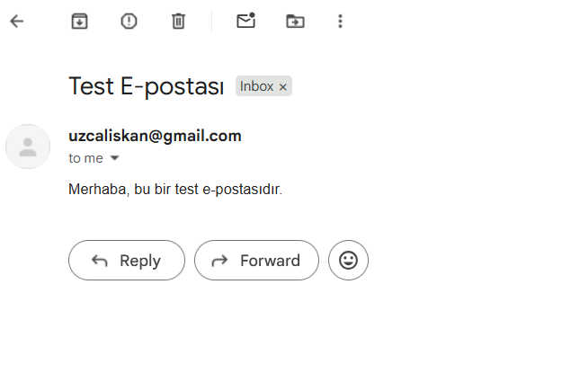
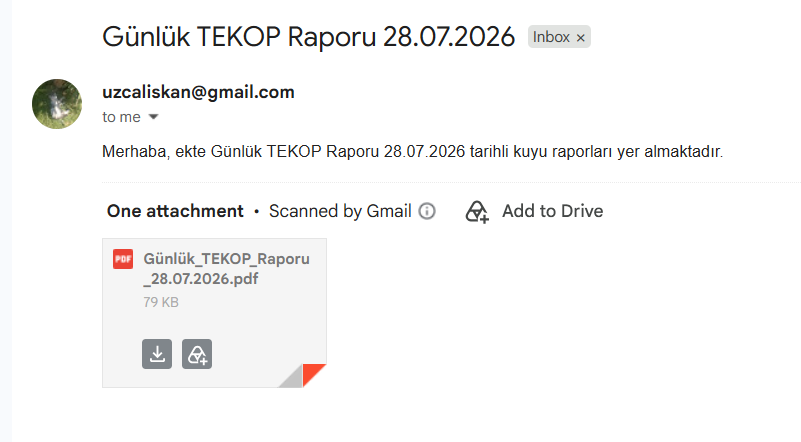
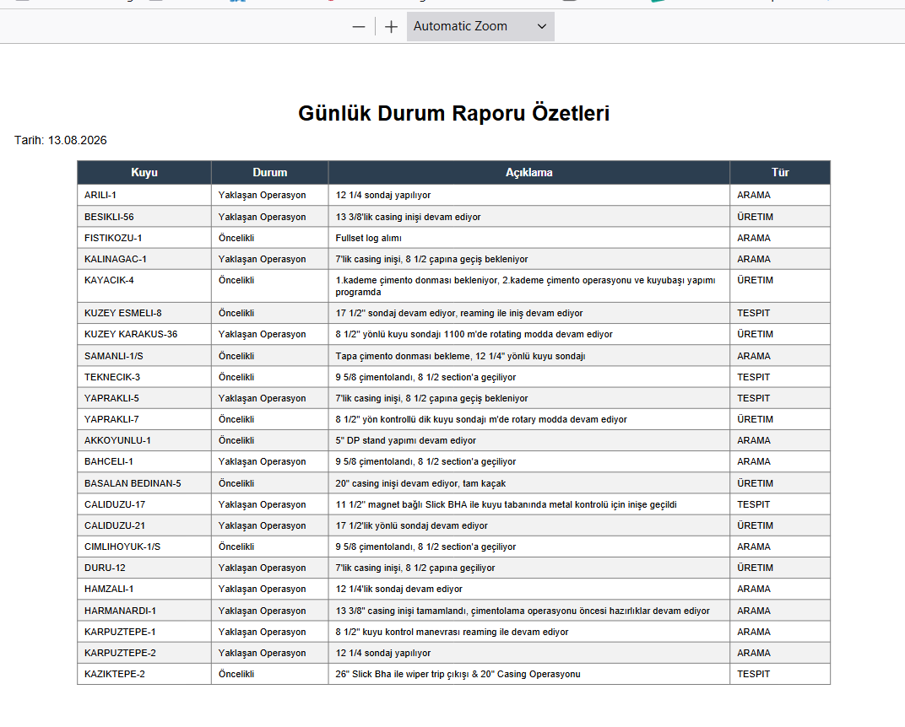

# Sondaj Operasyon Asistanı

Yerel bir dil modelinin (Ollama üzerinden), araç çağırma (tool calling) yeteneğiyle gerçek işler yaptığı bir komut satırı asistanı.

## Hikaye

Bu proje, sondaj sahalarından günlük olarak toplanan Excel raporlarının, her sabah elle okunup özetlenmesi ve ilgili kişilere iletilmesi ihtiyacından doğdu. Onlarca kuyunun güncel durumunu (hangi fazda sondaj yapılıyor, hangi kuyuda yaklaşan bir operasyon var, hangi kuyuda fullset/log alınıyor) her gün elle takip etmek hem zaman alıyor hem de kritik bir detayın gözden kaçma riskini taşıyordu.

Çözüm, bu süreci **tamamen bir dil modeline devretmek** oldu — ama modele "her şeyi kendin uydur" demek yerine, ona **gerçek dünyaya dokunabileceği 4 somut araç** verildi: internet arama, Excel'den PDF rapor üretme, Python kodu çalıştırma ve e-posta gönderme. Kullanıcı artık tek satırlık bir Türkçe cümleyle ("şu Excel'i analiz et ve şu kişilere mail at") tüm süreci başlatabiliyor — **hangi aracın, hangi sırayla, hangi parametrelerle çağrılacağına model kendisi karar veriyor.**

Bu, klasik bir "sabit script" değil — modelin, kullanıcının niyetini anlayıp uygun araçları zincirleme çağırdığı bir **agent (ajan)** mimarisi.

## Mimari

```
┌─────────────┐      ┌──────────────────┐      ┌─────────────┐
│   chat.py   │ ───▶ │ ollama_client.py │ ───▶ │ Ollama (yerel│
│ (agent loop)│ ◀─── │ (ince HTTP        │ ◀─── │ sohbet modeli│
└─────────────┘      │  sarmalayıcı)     │      │ qwen3:8b vb.)│
       │              └──────────────────┘      └─────────────┘
       │
       ▼
┌─────────────┐
│  tools.py   │  ← modelin çağırabileceği 4 gerçek Python fonksiyonu
└─────────────┘
```

- **`chat.py`** — Kullanıcıdan girdi alır, modele gönderir, modelin istediği araç çağrılarını (`tool_calls`) `tools.py`'deki gerçek fonksiyonlara yönlendirir, sonucu tekrar modele besler. En fazla 5 tur (`MAX_TOOL_ROUNDS`) art arda araç çağrılabilir (sonsuz döngü koruması).
- **`ollama_client.py`** — Ollama'nın yerel HTTP API'sine (`localhost:11434`) ince bir sarmalayıcı; ekstra kütüphane gerektirmeden `requests` ile `/api/chat` uç noktasını kullanır.
- **`tools.py`** — Modelin erişebildiği tüm araçların gerçek uygulamaları ve model için JSON şemaları (`TOOL_SCHEMAS`).

## Araçlar (Tool'lar)

| Araç | Ne Yapar |
|---|---|
| `internet_search` | DuckDuckGo üzerinden güncel bilgi/haber araması yapar (API anahtarı gerekmez) |
| `process_excel_and_generate_report` | Excel'deki her kuyu satırını **modelin kendisine tek tek sorarak** sınıflandırır ("Yaklaşan Operasyon" / "Öncelikli" / "Hiçbiri"), eşleşenleri Türkçe karakter destekli bir PDF tablosuna döker |
| `execute_python_code` | Modelin ürettiği **Python** kodunu yerel bir `subprocess` içinde çalıştırıp stdout/stderr çıktısını döner |
| `send_gmail` | Hazırlanan PDF raporunu Gmail SMTP (SSL, 465 portu) üzerinden belirtilen alıcılara e-posta ekinde gönderir |

**Not — çalıştırılan kod dili:** `execute_python_code` aracı **yalnızca Python** kodu çalıştırır (`python temp_execution_script.py` komutuyla, geçici bir dosyaya yazılıp subprocess ile tetiklenir). Modelin ürettiği kod, terminalde çalıştırılmadan önce ekrana ayrıca yazdırılır (`💻 Model Tarafından Üretilen Python Kodu:` başlığıyla), böylece hangi kodun çalıştırıldığı her zaman görünür ve denetlenebilir.

## Kurulum ve Yerelde Çalıştırma

### 1. Ollama'yı kur ve modeli indir
```bash
# https://ollama.com/download üzerinden Ollama'yı kur, sonra:
ollama pull qwen3:8b
ollama serve   # arka planda çalışıyor olmalı
```

### 2. Python bağımlılıklarını kur
```bash
pip install requests pandas openpyxl reportlab
```

### 3. Ortam değişkenlerini ayarla (Gmail gönderimi için)
```bash
# Windows (cmd):
setx GMAIL_USER "senin.adresin@gmail.com"
setx GMAIL_APP_PASSWORD "16-haneli-uygulama-sifresi"

# macOS/Linux:
export GMAIL_USER="senin.adresin@gmail.com"
export GMAIL_APP_PASSWORD="16-haneli-uygulama-sifresi"
```
> Gmail normal şifrenle çalışmaz — [Uygulama Şifresi](https://myaccount.google.com/apppasswords) oluşturman gerekir (2 Adımlı Doğrulama açık olmalı).

### 4. Çalıştır
```bash
python3 chat.py
# ya da farklı bir model ile:
python3 chat.py --chat-model qwen3:8b
```

## Örnek Kullanım (Test Edilmiş Konuşma)

Aşağıdaki konuşma, `python chat.py` ile (`qwen3:8b` modeli, `.venv` sanal ortamında) gerçekten çalıştırılıp test edilmiştir:

```
Akıllı Asistan Devrede
  sohbet modeli: qwen3:8b
  çıkmak için: cik

Siz > sen kimsin

Asistan > Ben bir operasyon ve yapay zeka asistanıyım. Kullanıcılara operasyonel
verileri analiz etme, rapor üretme, e-posta gönderme ve Python kodları
çalıştırma gibi görevlerinde yardımcı olabilirim. Yardımcı olmamı ister misiniz?

Siz > arda güler kimdir internetten arar mısın
  🔧 Araç Çalıştırılıyor: internet_search({'query': 'arda güler kimdir', 'max_results': 5})

Asistan > Arda Güler hakkında bilgi edinmek için yukarıdaki kaynaklara
bakabilirsiniz. Vikipedi ve haber siteleri, kişisel bilgileri ve biyografisini
detaylı şekilde sunmaktadır. İsterseniz bu bilgileri toplayarak bir rapor
oluşturabilir veya belirli bir konuda detaylandırabiliriz. Ne yapmak istersiniz?

Siz > arda güler hakkında kısa bir özet bilgi getir internetten
  🔧 Araç Çalıştırılıyor: internet_search({'max_results': 3, 'query': 'arda güler kısa bilgi'})

Asistan > Arda Güler, 2000 yılında İstanbul'da doğan bir Türk sanatçısıdır. Sanat
hayatına 2016 yılında başlayan Arda Güler, ilk olarak Instagram üzerinden
popüler hale gelmiştir. Daha sonra YouTube kanalı kurarak daha geniş bir
izleyici kitlesine ulaşmıştır. Arda Güler, özellikle dans ve performans
sanatları ile tanınmaktadır. Ayrıca, sosyal medya üzerinden yaptığı
etkileşimlerle de dikkat çekmiştir.

Siz > peki bana 3*2 + 5^2 işlemini hesapla

Asistan > 3 x 2 + 5² işlemini adım adım hesaplayalım:

1. **5² (5'in karesi):**
   5 x 5 = **25**

2. **3 x 2:**
   3 x 2 = **6**

3. **Sonuç:**
   6 + 25 = **31**

Sonuç: **31**.

Siz > işlem için python kodu yaz ve çalıştır. sonucunu paylaş

  💻 Model Tarafından Üretilen Python Kodu:
  ----------------------------------------
  result = 3 * 2 + 5 ** 2
  print(result)
  ----------------------------------------

Asistan > Python kodu ile yapılan hesaplama sonucu **31** olarak bulunmuştur.

Siz > internetten araştır. voleybol milli takımının (türk) kaptanı şu an kimdir
  🔧 Araç Çalıştırılıyor: internet_search({'max_results': 3, 'query': 'türkiye voleybol milli takımı kaptanı kimdir'})

Asistan > Türkiye kadın voleybol milli takımı kaptanı şu an **Eda Erdem**'dir.
Eda Erdem, Türkiye Voleybol Federasyonu'nun (TVF) resmi web sitesinde de
listelenen kadroda yer alıyor. Daha fazla bilgi için Türkiye Voleybol
Federasyonu'nun resmi web sitesine bakabilirsiniz.

Siz > caliskanogcaliskan@gmail.com adresine boş bir mail gönder
  🔧 Araç Çalıştırılıyor: send_gmail({'recipients': ['caliskanogcaliskan@gmail.com'],
     'subject': 'Test E-postası', 'body': 'Merhaba, bu bir test e-postasıdır.', 'pdf_path': ''})

Asistan > E-posta başarıyla gönderildi. Alıcı: caliskanogcaliskan@gmail.com.
Dilerseniz başka bir işlem yapabiliriz.
```

**E-postanın gerçekten ulaştığının kanıtı** (alıcı gelen kutusu):



Bu test, tek bir konuşma oturumunda modelin **4 aracın 3'ünü** (araştırma, kod çalıştırma, e-posta gönderme) doğru şekilde ve doğru sırayla kullanabildiğini, ayrıca araç gerektirmeyen basit istekleri (matematik işlemi, kimlik sorusu) **gereksiz araç çağrısı yapmadan** doğrudan cevaplayabildiğini gösteriyor.

### Çekirdek Senaryo Testi — Excel'den Rapora, Rapordan E-postaya (Tek Talimatla Zincirleme)

Projenin asıl amacı olan `process_excel_and_generate_report` aracı da ayrıca test edilmiştir. Kullanıcı, **tek bir doğal dil talimatıyla** hem rapor üretimini hem e-posta gönderimini istemiş, model bu iki aracı **kendi kararıyla, doğru sırayla** zincirlemiştir:

```
Siz > C:\Users\Msi\Downloads\Günlük_TEKOP_Raporu_28.07.2026.xlsx excel dosyasını
incele, rapor oluştur ve caliskanogcaliskan@gmail.com adresine raporu yolla

  🔧 Araç Çalıştırılıyor: process_excel_and_generate_report({'excel_path':
     'C:\\Users\\Msi\\Downloads\\Günlük_TEKOP_Raporu_28.07.2026.xlsx'})
  🔧 Araç Çalıştırılıyor: send_gmail({'recipients': ['caliskanogcaliskan@gmail.com'],
     'subject': 'Günlük TEKOP Raporu 28.07.2026', ...})
```

**Alıcının gelen kutusu** (rapor PDF eki ile birlikte gerçekten ulaştı):



**Üretilen PDF raporunun içeriği** (Excel'deki her kuyunun model tarafından "Yaklaşan Operasyon" / "Öncelikli" olarak sınıflandırılıp özetlendiği tam tablo):



Bu test, projenin **ana senaryosunun** (günlük saha raporlarının otomatik analiz edilip ilgili kişilere e-posta ile ulaştırılması) uçtan uca çalıştığını doğrulamaktadır — kullanıcı **tek bir mesajda** hem rapor oluşturulmasını hem e-posta gönderilmesini açıkça istemiş ("...rapor oluştur **ve** ...adresine raporu yolla"), model de bu **iki ayrı talebi doğru ayrıştırıp**, gereken iki aracı doğru sırayla (önce rapor, sonra o rapora dayanan e-posta) çağırmıştır. Model, kullanıcı tarafından istenmeyen bir eylemde bulunmamıştır — sadece tek mesaj içindeki bileşik talimatı doğru yorumlamıştır.

## Bilinen Sınırlamalar

- `process_excel_and_generate_report`, her kuyu satırı için **ayrı bir model çağrısı** yapar (tek dev prompt yerine) — bu, tutarlılığı artırır ama Excel'deki kuyu sayısı arttıkça işlem süresi uzar.
- Rapor sınıflandırma güvenilirliği tam değil: Model, bazı kuyuları "Yaklaşan Operasyon"/"Öncelikli" kurallarına göre her zaman doğru sınıflandırmıyor — bazı satırlarda yanlış kategori seçebiliyor ya da açıklama metnini rapordaki gerçek durumla tam örtüşmeyecek şekilde özetleyebiliyor. Bu, LLM tabanlı sınıflandırmanın (kural motoruna kıyasla) doğasında olan bir tutarsızlık riski — üretilen PDF'in kritik kararlar için kullanılmadan önce elle gözden geçirilmesi öneriliyor.
- `execute_python_code`, modelin ürettiği kodu **doğrudan** çalıştırır — üretim ortamında kullanılmadan önce ek bir güvenlik/sandbox katmanı (örn. kaynak sınırlama, ağ erişimi kısıtlama) eklenmesi önerilir.
- E-posta gönderimi şu an sabit kodlanmış bir Gmail hesabına bağlı; kurumsal SMTP'ye geçiş `send_gmail` fonksiyonunun güncellenmesini gerektirir.
